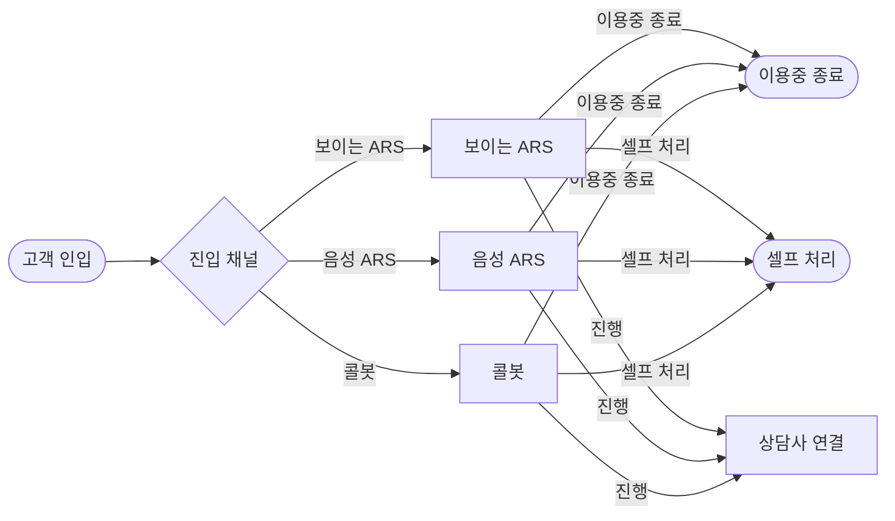
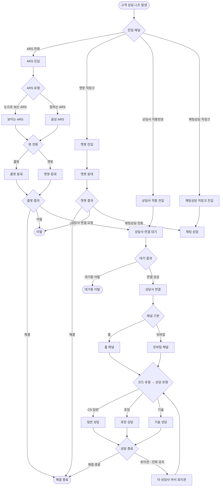

> ✅ **[활성 / aicc-console-mockup Journey 분석 화면]**
> 본 문서는 **AICC Journey(고객 여정 분석) 화면**의 기획서이며 `aicc-console-mockup`의 Journey 페이지(`funnel.html`)에 대응한다.
> 홈 화면은 본 분석의 **최소 신호(셀프 처리율 다이제스트)만** 노출하고(홈 PRD 9장), 상세 채널별 퍼널·이탈·셀프 처리·인사이트는 본 문서/화면에서 다룬다.

---

## 0. 고객 여정 모델 (현행 — 진입 채널별 퍼널)

> 최초 진입은 **보이는 ARS / 음성 ARS / 콜봇 3종**이며, 각 채널 노드에서 고객은 **이용중 종료**(중도 이탈)·**셀프 처리**(셀프서비스 완결)로 마무리되거나 **상담사 연결**로 진행한다. 세 채널 모두 동일 분기 구조로 상담사 연결에 합류한다. (4장 이하 레거시 S1~S6 모델은 참고용)



| 진입 채널 | 경로 | 각 노드 분기 |
|-----------|------|-------------|
| ① 보이는 ARS | 보이는 ARS → 상담사 연결 | 이용중 종료 / 셀프 처리 / 상담사 연결 |
| ② 음성 ARS | 음성 ARS → 상담사 연결 | 이용중 종료 / 셀프 처리 / 상담사 연결 |
| ③ 콜봇 | 콜봇 → 상담사 연결 | 이용중 종료 / 셀프 처리 / 상담사 연결 |

| 분기 | 의미 |
|------|------|
| 이용중 종료 | 해당 채널 이용 중 중도 종료(이탈) |
| 셀프 처리 | 해당 채널 셀프서비스로 문의 완결 |
| 상담사 연결 | 셀프 미완결 → 상담사 연결로 진행 (공통 합류점) |

> **정의 필요 규칙**: 채널 식별(보이는/음성 ARS·콜봇 코드 매핑) · 노드 분기 판정(이용중 종료/셀프 처리/진행) · 이용중 종료 타임아웃 · 셀프 처리 완결 기준 · 상담사 연결(시도/성공) 기준 · 산식(진행률·종료율·셀프율) · 재인입 중복 방지 · 집계 단위(전일/전주 동요일) · 데이터 소스 매핑 · 이상 임계 · 권한 범위 · Empty/표본 부족 처리. (상세는 홈 PRD 9장 정의 규칙 표와 동일 기준 적용)

---

# AICC Journey (고객 여정 분석) PRD

> **문서 버전:** v0.2 (외주 기획 발주용 초안)
> **최종 수정일:** 2025-05-29
> **대상 독자:** 외주 기획사, 내부 기획자, FE/BE 개발자, 데이터팀
> **위계:** U+AICC Console 직속 기능 (서비스보다 작은 단위 / 크로스-서비스)
> **브레드크럼:** `U+AICC Console > AICC Journey`

---

## 1. 문서 개요

### 1.1 목적
AICC 전체 서비스를 관통하는 **상담 고객(End-customer)의 여정 퍼널**을 분석하고, AI 기반 인사이트를 제안하여 운영 관리자가 이탈 구간과 개선 포인트를 빠르게 파악하도록 한다.

### 1.2 배경

| 문제 | 설명 |
|------|------|
| 분절된 분석 | 상담봇·어드바이저·AutoQA·VoiceToAction 등 서비스별로 데이터가 흩어져 고객 여정 전체를 한눈에 볼 수 없음 |
| 이탈 원인 파악 지연 | 어느 단계에서 고객이 이탈하는지 횡단 분석이 어려움 |
| 수동 분석 의존 | 운영자가 여러 서비스 리포트를 수기로 취합 → 시간·오류 비용 |

### 1.3 목표

- AICC 서비스 전체를 관통하는 고객 여정을 단일 퍼널로 시각화
- 단계별 전환율·이탈률을 기간/채널/팀 기준으로 분석
- AI가 이상 이탈 구간과 개선 포인트를 자동 제안
- 운영 관리자의 데이터 기반 의사결정 지원

### 1.4 비목표 (Non-Goals)

- 개별 상담 건 단위의 상세 로그 추적 (각 서비스 책임)
- 실시간(초 단위) 모니터링 (본 기능은 집계 기반 분석)
- 고객 개인 식별 정보(PII) 단위 분석

---

## 2. 사용자 및 권한

### 2.1 역할 등급 (참고)

```
현장 사용자 (상담사·코치·리더)        — 미노출
운영 관리자 (모회사 사업팀 직원)       — 노출 ✅ (기본 대상)
시스템 관리자 (사업팀 운영관리자)      — 노출 ✅
플랫폼 관리자 (PO)                     — 노출 ✅
```

### 2.2 권한 정책

| 항목 | 정책 |
|------|------|
| 노출 기준 | 운영 관리자 등급 이상 (`AICC_FUNNEL:VIEW` 권한 보유자) |
| 현장 사용자 | 홈 요약 카드 및 Funnel 페이지 모두 미노출 |
| 데이터 범위 | 권한에 따라 조회 가능 채널·팀 범위 제한 (Range 기반) |
| 인가 판단 | Mocha가 주입한 `X-User-Permissions` 기준, 페이지·API에서 최종 판단 |

---

## 3. 진입 경로

| 경로 | 성격 | 설명 |
|------|------|------|
| 홈 Funnel 요약 카드 | 상시 (메인) | Console 홈에 상설 노출되는 요약 카드 클릭 → Funnel 페이지 |
| 이상 징후 강조 | 능동 (보조) | 이상 징후 감지 시 요약 카드 강조 + 배너 → Funnel 페이지 |

> 별도 GNB 메뉴는 두지 않음. 홈 요약 카드가 상시 진입로 역할을 한다.

---

## 4. 고객 여정 퍼널 정의

> AICC 전체 서비스를 관통하는 상담 고객 여정. 단일 직선이 아니라 **다중 진입 → 채널 분기 → 합류 → 종료**의 복합 퍼널이다.
> 실제 단계·코드 매핑은 데이터팀·각 서비스팀과 협의하여 확정한다. (외주 착수 전 확정 필요)

### 4.1 전체 퍼널 구조도



### 4.2 퍼널 단계 정의 (공통 단계 모델)

> 메인 흐름은 **6개 단계(S1~S6)**로 정의한다. 화면(Journey Flow)과 본 정의는 동일한 단계 ID·명칭을 사용한다.
> ARS 유형·채널·상담유형은 별도 단계가 아니라 **단계 내 분기 속성**으로 관리하고, 이탈은 **단계별 이탈 유형**으로 관리한다.

| 단계 ID | 단계명 | 진행(다음 단계로) | 단계 내 분기 속성 | 이탈 유형 |
|---------|--------|------------------|------------------|-----------|
| S1 | 진입 | 봇 응대 또는 상담사 연결 대기(직통/직링크) | 진입 채널: ARS / 챗봇 직링크 / 상담사 직통 / 채팅상담 직링크 · ARS 유형: 보이는 ARS / 음성 ARS | — |
| S2 | 봇 응대 | 봇 결과로 진행 | 봇 종류: 콜봇 / 챗봇 | 미진입 이탈 |
| S3 | 봇 결과 | 상담사 연결 요청 / 채팅상담 전환 | — | 봇 이탈, 봇 해결(종료) |
| S4 | 연결 대기 | 상담사 연결 성공 | — | **대기중 이탈 ★** |
| S5 | 상담 진행 | 상담 종료로 진행 | 채널: 홈 / 모바일 · 상담유형: CS일반 / 로밍 / 기술 | — |
| S6 | 종료 | (여정 종료) | 종료 유형: 해결 종료 / 호이관(전화 유지 → S5 재분류) | **호이관 ★** |

> **종료 상태**(여정의 최종 도달점): 해결 종료 / 이탈 / 대기중 이탈
> **★ 핵심 추적 지점**: S4 대기중 이탈, S6 호이관(FCR 역지표)

### 4.3 핵심 지표

| 지표 | 정의 |
|------|------|
| 진입 채널 믹스 | 진입로별 인입 비율 |
| 봇 자동완결률 (Containment) | 봇 단계에서 해결 / 전체 봇 세션 |
| 봇→상담사 전환율 | 봇이 해결 못 하고 상담사로 넘긴 비율 |
| 대기 이탈률 (Abandon) | 상담사 연결 대기 중 이탈 비율 |
| 이탈 임계 시간 | 대기 이탈이 급증하는 대기시간 임계점 |
| 채널×상담유형 분포 | 홈/모바일 × CS/로밍/기술 매트릭스 |
| 호이관율 (Transfer) | 1회 미해결로 넘긴 비율 (FCR 역지표) |
| End-to-End 완주율 | 인입 → 해결 도달 비율 |
| 재인입률 | 해결 후 일정 기간 내 재문의 비율 (가짜 해결 탐지) |

---

## 5. 화면 구성

> 총 1~2개 화면. 화면 2는 화면 1의 드릴다운으로, 범위·예산에 따라 통합 또는 분리한다.
> **AI 인사이트가 본 화면의 핵심**이므로 본문 메인 영역에 배치하고, 차트는 이를 뒷받침하는 보조 영역으로 둔다.

### 5.1 화면 1 — Funnel 대시보드 (필수)

> 화면 배치 순서: 브레드크럼 → 헤더 → 필터 → KPI → **Journey Flow** → (AI 인사이트 + 보조 차트) 2단

| No | 영역 | 상세 정책 |
|----|------|-----------|
| F1-1 | 브레드크럼 | `U+AICC Console > AICC Journey` |
| F1-2 | 페이지 헤더 | 타이틀 + 마지막 데이터 갱신 시각 |
| F1-3 | 필터 바 | 기간(일/주/월/기간 지정) · 진입채널 · 채널(홈/모바일) · 상담유형 · 팀/센터 / 권한 범위 내 |
| F1-4 | 핵심 지표 KPI | 전체 인입·봇 자동완결률·대기 이탈률·호이관율·완주율 카드 (전주 대비 추세) |
| F1-5 | **Journey Flow (여정 흐름)** | 진입→봇→연결→상담→종료를 **단일 가로 흐름**으로 통합 표현. 메인 라인은 진행, 각 단계 아래 가지로 이탈(이탈/대기중 이탈/호이관) 분리 시각화. 단계별 건수·잔존율 표기 / **노드 클릭 시 단계별 드릴다운(5.3)**. *(기존 세로 퍼널과 통합 — 중복 제거)* |
| F1-6 | **AI 인사이트 패널 (핵심·메인)** | 본문 좌측 메인 영역. 현상→원인후보→Action 카드 (6장 원칙 적용) / 심각도·신뢰도·근거·피드백 포함 |
| F1-7 | 보조 차트 (우측) | 대기 이탈률 추세 / 진입 채널 믹스 / 채널×상담유형 분포 — 인사이트를 뒷받침하는 정량 차트 |
| F1-8 | Empty/권한/표본부족 상태 | 데이터 없음 / 권한 없음 / 표본 부족(분석 보류) 처리 |

> **Journey Flow와 AI 인사이트의 역할 분리**
> - Journey Flow: "어디서 얼마나 빠지는가"(현상의 시각적 진입점)
> - AI 인사이트: "왜 빠지는가 + 무엇을 할까"(해석과 액션)
> - 단계별 단순 전환율 테이블은 Journey Flow에 통합되어 별도 퍼널 영역을 두지 않는다.

### 5.2 화면 2 — 단계 드릴다운 / 세그먼트 상세 (선택)

| No | 영역 | 상세 정책 |
|----|------|-----------|
| F2-1 | 단계 상세 | 선택 단계의 이탈 상세 (진입채널·상담유형·시간대별 분해) |
| F2-2 | 세그먼트 비교 | 채널/상담유형/팀 간 여정 비교 |
| F2-3 | AI 상세 제안 | 해당 단계 현상→원인후보→Action 상세 + 근거 드릴다운 |
| F2-4 | 데이터 내보내기 | CSV/Excel 다운로드 (권한 시) |

### 5.3 Journey Flow 노드 클릭 드릴다운

> Journey Flow의 각 단계 노드를 클릭하면 우측 패널(Drawer)로 해당 단계의 상세를 보여준다. 단계 공통 요소 + 단계별 핵심 분석으로 구성한다.

**공통 표시 (모든 단계)**

| 항목 | 내용 |
|------|------|
| 단계 요약 | 유입 건수 · 잔존율 · 이탈 건수 |
| 세그먼트 분해 | 진입채널 / 상담유형 / 시간대별 분포 |
| 눈여겨볼 점 | 해당 단계 주요 특이사항 |
| 관련 인사이트 | 이 단계와 연결된 AI 인사이트로 이동 |

**단계별 핵심 분석**

| 단계 | 드릴다운 핵심 |
|------|--------------|
| S1 진입 | 진입채널 4종 비중 + ARS 유형(보이는/음성) |
| S2 봇 응대 | 콜봇/챗봇 분포 + 미진입 이탈 |
| S3 봇 결과 | 인텐트별 응답 실패율 Top + FALLBACK 상위 질문 |
| S4 연결 대기 | **대기시간 구간별 이탈 곡선 + 이탈 임계 시간** (핵심) |
| S5 상담 진행 | 채널×상담유형 매트릭스 + 평균 처리시간 |
| S6 종료 | 해결/호이관 비율 + 호이관 경로 + 재인입률 |

---

## 6. AI 인사이트 생성 원칙

> 본 기능의 신뢰성은 **"AI가 단정하는 영역과 추론하는 영역을 분리"**하는 데 달려 있다. 아래 원칙을 외주 기획·구현의 필수 요건으로 한다.

### 6.1 신뢰도 기반 3층 구조

| 층위 | 산출 방식 | AI 자율성 | 표현 톤 (구어체) |
|------|-----------|-----------|---------|
| 현상 (What) | 결정론적 통계 집계 | 단정 허용 | "~했습니다 / ~입니다" (사실 전달) |
| 원인 (Why) | 사전 정의 원인 후보 풀 내 상관 매칭 | **확정 금지 / 후보 랭킹만** | "~로 보입니다 / ~인 것 같습니다" + 신뢰도 |
| Action (How) | 사전 정의 Action 카탈로그 내 선택 | **자유 생성 금지** | "~해 보세요 / ~검토를 권장합니다" (명령 아님) |

> LLM의 역할은 위 구조화된 결과를 **읽기 좋게 요약**하는 것에 한정한다. 운영자에게 말하듯 친근한 구어체로 전달하되, 원인·Action을 자유 생성하지 않는다.

### 6.2 핵심 원칙

| 원칙 | 내용 |
|------|------|
| 근거 동반 강제 | 모든 인사이트는 원천 수치로 드릴다운 가능해야 함 / 근거 없으면 미표시 |
| 원인은 후보 랭킹 | 단일 원인 확정 대신 상관 높은 요인 순으로 제시 |
| Action은 카탈로그 선택 | 원인별 사전 매핑된 Action 후보에서만 선택 |
| 보수적 노출 | 통계 유의·표본 충분 시에만 노출 / 미달 시 "특이사항 없음" |
| Top N 노출 | 심각도 상위 N개만 / 나머지는 더보기 |
| 신뢰도 라벨 | 각 인사이트에 확정/추정/참고 라벨 표기 |
| 피드백 루프 | 도움됨/아니에요(👍/👎) 수집 → 부정 피드백 누적 규칙 비활성화·임계 재조정 |

### 6.3 단계적 도입 (Phase)

| Phase | 범위 | 외주 1차 |
|-------|------|---------|
| Phase 1 | 임계값 규칙 기반 현상 탐지 | ✅ 포함 |
| Phase 2 | 추세·통계적 이상치 감지 | ✅ 포함 |
| Phase 3 | 원인 후보 상관 분석 자동 랭킹 | 차기 |
| Phase 4 | 예측·생성형 고도화 | 차기 (데이터 신뢰 축적 후) |

### 6.4 인사이트 카드 출력 템플릿

> 운영자에게 말하듯 구어체로 전달한다. 현상은 굵게 강조하고, 원인은 추정 톤, Action은 권유 톤으로 표기한다.

```
┌─ [심각도: 높음] [NEW] 봇 실패 · 봇 결과 ──────────────────┐
│ 무슨 일?   요금조회 인텐트 응답 실패율이 12%에서 31%로        │
│            급증했습니다 (전주 대비)                          │
│ 왜 그럴까?  새 요금제 발화가 아직 학습되지 않아서인 것 같아요   │
│            (신뢰도: 중간)                                   │
│ 해보세요    · 해당 인텐트 학습데이터를 보강해 주세요 [서비스팀] │
│            · 임시 FALLBACK 답변을 등록해 두시면 좋겠습니다 [운영자] │
│ 근거        DEFAULT_FALLBACK_LIST 3,200건 증가 (근거 상세 보기 ›)  │
│                                          이 분석이 도움이 됐나요? [👍][👎] │
└────────────────────────────────────────────────────┘
```

> **레이아웃 가중치**: 카드에서 **현상(가장 크게) > 원인·Action > 근거(블록 강조) > 피드백(최소)** 순으로 시각 위계를 둔다. 근거는 박스로 강조하고, 피드백(👍/👎)은 작게 우측 정렬한다.

### 6.5 TOPIC 분류 체계

| 항목 | 내용 |
|------|------|
| TOPIC 카테고리 | 이탈 / 실패 / 지연 / 품질 / 재문의 등 (착수 전 확정) |
| 클러스터링 기준 | 키워드·인텐트를 TOPIC으로 묶는 규칙 정의 |
| 서비스별 매핑 | 콜봇 TOPIC ≠ 어드바이저 TOPIC, 서비스별 별도 정의 |

---

## 7. 인사이트 카탈로그 (현상 → 원인 후보 → Action)

> 외주 기획 시 아래를 기준으로 확장한다. 원인은 "후보"이며 확정이 아니다.

### 7.1 진입·봇 효율 (S1~S3)

| TOPIC | 현상(자동 집계) | 원인 후보 | Action 후보 | 근거 데이터 |
|-------|----------------|-----------|-------------|-------------|
| 진입 채널 변화 | 직통번호 인입 급증 | 셀프서비스(봇/ARS) 실패 가능성 | ARS·봇 시나리오 점검 검토 | `RP_CHAN_NAME`, `OPENCHANNEL_CODE` |
| ARS 효율 | 보이는 ARS 완결률 < 음성 ARS | 보이는 ARS UI 이탈 가능성 | 보이는 ARS 플로우 개선 검토 | ARS 인입·완결 로그 |
| 봇 자동완결률 | 봇 완결률 하락 | 인텐트 미학습 / 신규 이슈 유입 | 학습데이터 보강·시나리오 점검 | `RP_RESULT_CODE`, `DIALOG_HISTORY` |
| 봇 응답 실패 | 특정 인텐트 실패율 급증 | 신규 발화 미학습 추정 | 인텐트 재학습 / FALLBACK 등록 | `DEFAULT_FALLBACK_LIST`, `RP_TASK` |

### 7.2 대기 이탈 (S4) ★

| TOPIC | 현상 | 원인 후보 | Action 후보 | 근거 데이터 |
|-------|------|-----------|-------------|-------------|
| 대기 이탈 급증 | 상담사 연결 대기 이탈률 상승 | 대기시간 초과 / 피크타임 인입 집중 | 피크타임 인력 재배치 검토 | ACD/CTI 큐 대기·이탈 로그 |
| 이탈 임계 시간 | 평균 N분 초과 시 이탈 급증 | 대기 인내 한계 | 콜백·예상대기 안내 도입 검토 | CTI 대기시간 분포 |

### 7.3 채널·상담유형 (S5)

| TOPIC | 현상 | 원인 후보 | Action 후보 | 근거 데이터 |
|-------|------|-----------|-------------|-------------|
| 채널×유형 쏠림 | 특정 채널·유형 인입 급증 | 외부 이슈 / 프로모션 영향 | 해당 유형 인력·FAQ 보강 | 어드바이저 코드유형·채널 |
| 라우팅 오류 | 특정 코드유형 호이관 빈발 | 초기 분류·라우팅 오류 추정 | 라우팅 규칙·코드 정의 점검 | 호이관 로그 |

### 7.4 호이관·종료 (S6)

| TOPIC | 현상 | 원인 후보 | Action 후보 | 근거 데이터 |
|-------|------|-----------|-------------|-------------|
| 호이관율 상승 | 1회 미해결 호이관 증가 | 1차 상담사 스킬 갭 | 상담사 교육·스킬 매핑 점검 | CTI 호 전환 로그 |
| 가짜 해결 | 해결 후 단기 재인입 증가 | 1차 응대 미흡 추정 | 응대 품질 점검 (AutoQA 연계) | `RP_REVISIT`, `RP_REVISIT_SUMMARY` |

### 7.5 여정 전체 (크로스)

| TOPIC | 현상 | 원인 후보 | Action 후보 | 근거 데이터 |
|-------|------|-----------|-------------|-------------|
| 완주율 하락 | End-to-End 완주율 하락 | 특정 단계 이탈 누적 | 최대 이탈 단계 집중 개선 | 전체 여정 집계 |
| 이상 징후 | 특정 구간 지표 평소比 급변 | 단계별 복합 요인 | 홈 배너 알림 + 상세 분석 유도 | 전 단계 집계 (홈 8장 연동) |


---

## 7. 데이터 요구사항

| 항목 | 내용 |
|------|------|
| 데이터 출처 | 상담봇·어드바이저·AutoQA·VoiceToAction 등 각 서비스 집계 데이터 |
| 수집 방식 | Batch 집계 (Admin DB 적재 구조 활용) — 실시간 아님 |
| 갱신 주기 | 협의 필요 (예: 1시간/일 단위) |
| 식별 단위 | 고객 여정 세션 단위 (PII 제외, 익명 집계) |
| 데이터 정합성 | 서비스 간 여정 연결 키(세션/고객 식별자) 정의 필요 — **착수 전 데이터팀 확정 필수** |

### 7.1 단계별 데이터 소스 매핑 (확보 현황)

| 단계 | 데이터 소스 | 확보 여부 |
|------|------------|-----------|
| S1 진입 | `RP_CHAN_NAME`, `OPENCHANNEL_CODE`, `RP_OPEN_CHAN_NAME` / ARS 인입·완결 로그 | 콜봇 데이터 ✅ / ARS·직통 인입 로그 ⚠️ 확인 필요 |
| S2 봇 응대 · S3 봇 결과 | `DIALOG_HISTORY`, `RP_RESULT_CODE`, `DEFAULT_FALLBACK_LIST`, `RP_TASK` | 콜봇 데이터 ✅ |
| S4 연결 대기 | ACD/CTI 큐 대기·이탈 로그 | ★ ⚠️ **미확보 — 필수 확보 대상** |
| S5 상담 진행 (채널·상담유형) | 상담 어드바이저 코드유형·채널 데이터 | ★ ⚠️ **미확보 — 필수 확보 대상** |
| S6 종료 (호이관) | CTI 호 전환(transfer) 로그 | ★ ⚠️ **미확보 — 필수 확보 대상** |
| 재인입 (S6 이후) | `RP_REVISIT`, `RP_REVISIT_SUMMARY` | 콜봇 데이터 ✅ |
| 여정 연결 키 | `SESSION_HISTORY`, `CUST_JOURNEY*`, `CUSTOMER_JOURNEY_MANAGEMENT` | 콜봇 일부 ✅ / 서비스 간 조인 키 정의 필요 |

> **콜봇/챗봇 데이터로는 S1~S3까지 분석 가능**. S4~S6(대기 이탈·채널/유형·호이관)은 **ACD/CTI 및 어드바이저 데이터 확보가 선행**되어야 한다.

---

## 8. 홈 연계 (요약 카드)

> 상세는 홈 PRD에서 정의. 본 문서는 연계 지점만 명시.

| 항목 | 내용 |
|------|------|
| 위치 | Console 홈 (운영 관리자 이상에게만 상설 노출) |
| 내용 | 전체 완주율 + 추세(▲▼) + AI 인사이트 1줄 |
| 동작 | 클릭 시 `U+AICC Console > AICC Journey` 진입 |
| 강조 | 이상 징후(이탈 급증) 발생 시 카드 강조 |

---

## 9. 외주 범위 정의 (Scope)

> 1천만원 외주 기획 산출물의 경계를 명확히 하여 정산·검수 분쟁을 방지한다.

### 9.1 포함 범위 (In-Scope)

- 화면 1 (Funnel 대시보드) 기획: 와이어프레임 + 화면 정의서 + 인터랙션 정의
- 화면 2 (드릴다운) 기획 — 범위 협의에 따라 포함/제외
- 퍼널 단계 정의 문서화 (데이터팀 협의 결과 반영)
- AI 인사이트 UX 기획: 현상→원인후보→Action 카드 구조 (6장 원칙 적용)
- TOPIC 분류 체계 설계 (6.5)
- Action 카탈로그 설계 (원인별 권장 Action 매핑)
- 인사이트 신뢰도 라벨·근거 드릴다운·피드백 UX 정의
- 필터·드릴다운 인터랙션 흐름 정의
- 권한별 노출/제한 정책 정의

### 9.2 제외 범위 (Out-of-Scope)

- 실제 화면 디자인(Hi-Fi 비주얼) — 사내 디자인 시스템 적용 시 별도
- 백엔드 데이터 파이프라인 구축
- AI 모델 개발/학습 (Phase 3~4 별도)
- 각 서비스의 데이터 제공 규격 정의 (각 서비스팀 책임)
- ACD/CTI 데이터 연동 개발 (인프라팀)
- Console 홈 요약 카드 구현 (내부 진행)

### 9.3 산출물 (Deliverables)

| 산출물 | 형식 |
|--------|------|
| 화면 정의서 | 화면별 영역·기능·정책 문서 |
| 와이어프레임 | 화면 1~2개 |
| 인터랙션 정의서 | 필터·드릴다운·AI 패널 동작 |
| 퍼널/지표 정의서 | 단계·지표 산출 기준 |

### 9.4 검수 기준 (Acceptance)

- 정의된 화면(1~2개)의 모든 영역(F1-x, F2-x) 기획 충족
- 퍼널 단계·지표 정의가 데이터팀 확정안과 일치
- 권한 정책이 역할 등급 체계와 일치
- 홈 연계 흐름이 본 문서와 정합
- AI 인사이트가 6장 원칙(현상 단정 / 원인 후보 / Action 카탈로그 / 근거 동반 / 보수적 노출) 준수
- 모든 인사이트 카드에 근거 드릴다운·신뢰도 라벨·피드백 UX 포함

---

## 10. 미결 사항 (착수 전 확정 필요)

| No | 항목 | 내용 | 담당 | 우선순위 |
|----|------|------|------|---------|
| 1 | 퍼널 단계 확정 | 4.2 공통 단계 모델(S1~S6) 데이터팀·서비스팀 검증 | 기획/데이터/서비스팀 | 必 |
| 2 | 여정 연결 키 | 서비스 간 고객 여정 연결 식별자 정의 (`SESSION_HISTORY` 등) | 데이터팀 | 必 |
| 3 | S4~S6 데이터 확보 | ACD/CTI 대기·이탈·호이관 + 어드바이저 코드유형·채널 데이터 | 데이터/인프라팀 | 必 |
| 4 | TOPIC 분류 체계 | 이탈/실패/지연/품질/재문의 카테고리 + 클러스터링 기준 | 기획/데이터팀 | 必 |
| 5 | Action 카탈로그 | 원인별 권장 Action 매핑 + 실행 주체 정의 | 기획/운영팀 | 必 |
| 6 | 임계값/기준선 | 지표별 정상 범위·이상 임계·비교 기준(전주/전월/동요일) | 기획/데이터팀 | 必 |
| 7 | 화면 수 확정 | 화면 2 포함 여부 (예산 연동) | 기획/발주 | 高 |
| 8 | AI 제안 수준 | 1차 범위 = 규칙 기반(Phase 1~2)로 한정 확인 | 기획/AI팀 | 高 |
| 9 | 권한 Authority | `AICC_FUNNEL:VIEW` 등 권한 식별자 확정 | 기획/운영관리포털팀 | 高 |
| 10 | 인사이트 우선순위 | 심각도 스코어링 기준 + 홈 노출 Top N 개수 | 기획 | 中 |
| 11 | 상담/쇼핑 트랙 분리 | `CUST_JOURNEY*`(쇼핑) vs 일반 상담 퍼널 분리 여부 | 기획/데이터팀 | 中 |
| 12 | 데이터 갱신 주기 | Batch 집계 주기 | BE/데이터팀 | 中 |
| 13 | 데이터 내보내기 | CSV/Excel 제공 여부 및 권한 | 기획/보안 | 中 |
| 14 | 피드백 루프 | 인사이트 정확도 개선 위한 피드백 수집·반영 방식 | 기획/AI팀 | 中 |

---

## 11. 고객 여정 성숙도 로드맵

> 본 기능(AICC Journey)과 AICC Watchtower는 업계 표준 성숙도 4단계 위에 위치한다. 현재 위치와 진화 방향을 명시하여 "분석을 넘어 예측·오케스트레이션으로 간다"는 방향성을 공유한다.

| 단계 | 핵심 질문 | 시점 | 주체 | 본 프로젝트 위치 |
|------|-----------|------|------|------------------|
| 1. Journey Mapping | 여정이 어떻게 생겼나 | 정적 | 기획자 수기 | (선행 완료) |
| 2. Journey Analytics | 어디서 얼마나 빠졌나 | 사후 집계 | 분석가 해석 | **AICC Journey (현재)** |
| 3. Journey Measurement | 지금 무슨 일이 일어나나 | 근실시간 | 운영자 감시 | **AICC Watchtower (현재)** |
| 4. Journey Orchestration | 이탈 직전 무엇을 해줄까 | 실시간 | 시스템 자동 개입 | **차기 비전** |

### Phase 구분

| Phase | 범위 | 비고 |
|-------|------|------|
| Phase 1 (현재) | Analytics(AICC Journey) + Observability(Watchtower) — "보이게" 만든다 | 본 발주 범위 |
| Phase 2 | Measurement 고도화 + **Predictive(예측)** — 근미래를 미리 본다 | 12장 |
| Phase 3 | Journey Orchestration — 실시간 자동 개입(NBA·자동 라우팅) | 비전 |

---

## 12. Phase 2 — Watchtower 예측(Predictive) 기능

> 실시간 측정(Measurement)과 근미래 예측(Predictive)을 **한 화면에서 대비**하여, 문제가 터지기 전에 선제 대응하도록 한다. 예측은 추정이므로 6장 신뢰도 원칙(추정 톤·근거·보수적 노출)을 동일하게 적용한다.

### 12.1 예측 레인 (Measurement vs Predictive)

| 항목 | 내용 |
|------|------|
| 구성 | 지표별 **현재값(실시간) → +10분/+30분 예측값**을 좌우로 대비 표시 |
| 예측 지표 | 전체 인입 · 상담 대기 · ARS 인입 · 콜봇 부하 (확장 가능) |
| 예측 방식 | Phase 2 초기: 추세(기울기) 외삽 / 고도화: 시계열 모델(ARIMA·Prophet·LSTM) |
| 임계 연동 | 예측값이 임계 초과 시 "N분 뒤 임계 초과 예상" 경고 표시 |
| 시점 전환 | +10분 / +30분 토글 |

### 12.2 추세+임계 기반 권장 조치

| 트리거 | 권장 조치 (예시) | 담당 |
|--------|------------------|------|
| 상담 대기 예측 ≥ 임계 | "N분 뒤 대기 X명 예상 → 상담사 Y명 추가 투입 권장" | 상담 운영팀 |
| ARS 인입 증가 추세 | "N분 뒤 콜 적체로 연결 지연 예상 → 콜봇 우회 안내·인력 사전 배치" | 상담 운영팀 |
| 콜봇 부하 상승 추세 | "N분 뒤 위험 도달 가능 → 특정 콜 집중 여부 점검" | 상담봇 스쿼드 |

### 12.3 표현 원칙

- 예측값은 "~예상됩니다 / ~가능성이 있습니다" 추정 톤
- 예측 신뢰도 라벨 표기 (데이터·모델 성숙도 따라)
- 오탐 관리: 표본·변동성 큰 구간은 예측 보류("예측 신뢰도 낮음")

### 12.4 선행 조건

| 항목 | 내용 |
|------|------|
| 실시간 데이터 파이프라인 | 집계(Batch) → 근실시간 스트리밍 전환 (미결 #3 연동) |
| 시계열 학습 데이터 | 지표별 최소 수 주~수 개월 시계열 확보 |
| MLOps | 예측 모델 학습·배포·모니터링 체계 |
| 임계·기준선 | 12.2 트리거의 임계값 확정 (미결 #6 연동) |

> **범위 주의:** 11~12장은 **방향성·Phase 2 명세**이며 **본 발주(Phase 1) 범위에 포함되지 않는다.** 예측 기능은 데이터 파이프라인·MLOps 선행 후 별도 발주로 추진한다.
