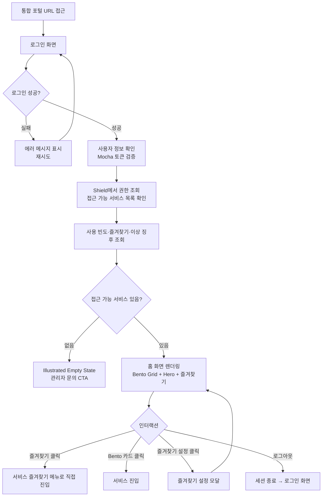
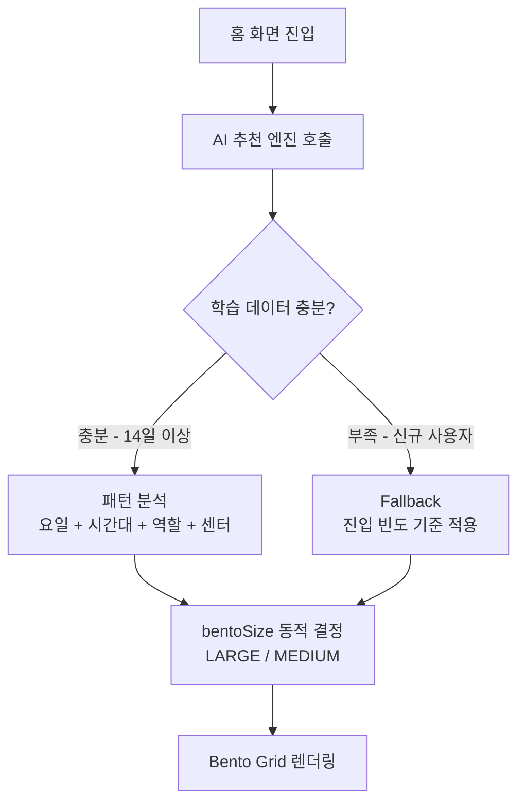
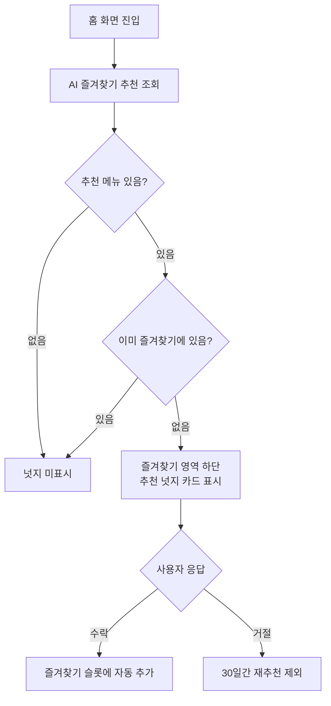
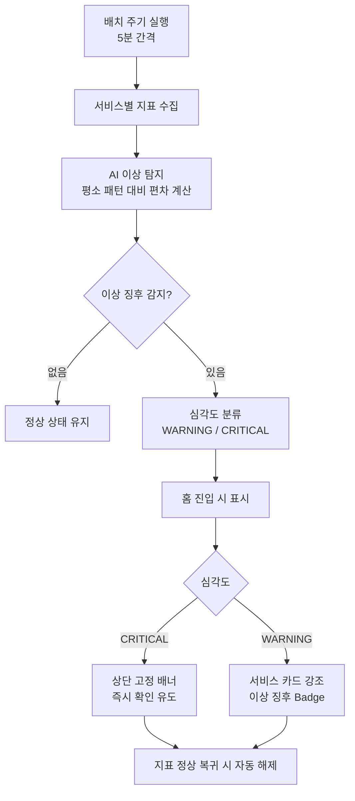

# U+AICC Console 홈 PRD

> **문서 버전:** v3.0
> **최종 수정일:** 2025-05-29
> **대상 독자:** 내부 기획자, FE/BE 개발자, QA

---

## 1. 문서 개요

### 1.1 목적
사용자 로그인 경험 단순화 및 통합 포털의 단일 진입점 구축

### 1.2 비즈니스 배경

| 문제 | 설명 |
|------|------|
| 진입 경로 불명확 | 사용자가 서비스 진입 경로를 직관적으로 이해하기 어려움 |
| 유지보수 비용 | 서비스 확장(신규 서비스 추가)에 따른 유지보수 비용 증가 |

### 1.3 사용자 문제

- 접근 가능한 서비스가 무엇인지 한눈에 확인 어려움
- 반복 사용 서비스로 빠르게 이동하기 어려움
- 권한 없는 서비스가 보이는 경우 혼란 발생

### 1.4 비즈니스 목표

- 통합 포털의 단일 진입점 구축
- 서비스 접근성 개선 → 서비스 이용률 증가
- 권한 기반 서비스 노출로 보안 및 UX 개선
- 확장 가능한 서비스 구조 확보

### 1.5 UX 목표

| 목표 | 설명 |
|------|------|
| 인지성 | Bento Grid 레이아웃으로 서비스 목록과 위계를 직관적으로 이해 |
| 효율성 | 1-click으로 서비스 진입 / 즐겨찾기로 반복 업무 단축 |
| 개인화 | AI 기반 사용 패턴 학습으로 카드 배치·즐겨찾기 자동 최적화 |
| 명확성 | 권한 기반 노출 / 이상 징후 즉시 인지 |
| 일관성 | 디자인 시스템 기반 UI 제공 |

### 1.6 성공 지표 (KPI)

| 지표 | 설명 |
|------|------|
| 권한 오류 감소율 | 잘못된 접근 시도 감소율 |
| CTR | 홈 → 서비스 진입 클릭률 |
| 진입 시간 | 평균 서비스 진입 시간 (Login → Service Click) |

---

## 2. 전체 UX Flow



---

## 3. 구현 내용

### 3.1 기본 정책

#### 권한 정책
- 권한 없는 서비스 → **카드 노출은 유지**하되 **disabled 상태**로 표시, 클릭 시 **권한 안내 Modal** 노출
  - Modal: `사용 권한 필요` / `{서비스명} 접근 권한이 없습니다. 관리자에게 요청하세요.`
- 권한 데이터는 Mocha Gateway가 주입한 `X-User-Permissions` 헤더 기반으로 판단
- 서비스별 접근 가능 여부는 BE에서 최종 판단 후 응답

#### 권한 판단 방식 (홈 전용)
- Mocha 헤더 파싱 + **Mocha route metadata에 홈 전용 `productId=ALL` 추가**
- 홈 진입 시 전체 서비스(`ADVISOR`/`CALLBOT`/`AUTOQA`/`V2A`)의 권한이 `X-User-Permissions` 헤더에 한 번에 포함되도록 함
- 이유: 홈 화면은 모든 서비스의 권한을 한 번에 알아야 Bento Grid를 disabled 여부까지 포함해 렌더링할 수 있음

#### UI 정책
- 카드 스타일 (디자인 시스템 기반)
- Bento Grid 레이아웃 (사용 빈도 기반 카드 크기 차등)
- 즐겨찾기 슬롯 방식 (최대 5개 고정 슬롯)

#### 확장 정책
- 서비스 추가 시 Service Registry만 수정
- UI 변경 없이 Bento Grid에 자동 반영

### 3.2 주요 시나리오

| 시나리오 | 설명 |
|----------|------|
| 정상 로그인 후 서비스 선택 | Bento Grid에 권한 있는 서비스 카드 표시 → 클릭 시 이동 |
| 즐겨찾기 진입 | 설정된 서비스+메뉴로 1-click 직접 진입 |
| 즐겨찾기 미설정 | 빈 슬롯 + 추가 버튼으로 설정 유도 |
| 접근 가능한 서비스 없음 | Empty State + 관리자 문의 CTA |
| 서비스 간 이동 | GNB 스위처 드롭다운으로 세션 유지하며 이동 |
| 로그아웃 | 세션 종료 후 로그인 화면으로 이동 |

### 3.3 화면 구조

```
GNB
├── 로고 (서비스 스위처 겸용)
├── 전체 알림 아이콘 + Pulse Badge
└── 프로필 아바타 (이름, 역할, 로그아웃)

Content Area
├── [Hero 영역]
│   ├── 환영 메시지 + 이모지
│   ├── 직책(IM 기준) + 소속 팀
│   └── 긴급 알림 발생 시 강조 배너 (조건부)
│
├── [즐겨찾기 영역]
│   ├── 즐겨찾기 카드 슬롯 (최대 5개)
│   │   ├── 설정된 슬롯: 서비스 아이콘 + 서비스명 + 메뉴명
│   │   └── 빈 슬롯: + 추가 버튼
│   └── 즐겨찾기 설정 버튼 → [즐겨찾기 설정 모달]
│       ├── 서비스 목록 (체크박스, 최대 5개)
│       ├── 서비스별 즐겨찾기 메뉴 선택 (서브메뉴)
│       └── 저장 / 취소
│
├── [Funnel 요약 영역]  (운영 관리자 이상)
│   ├── 고객 여정 최소 신호 (셀프 처리율 + 전주 동요일 대비 추세 + 조건부 주의)
│   ├── AI 인사이트 1줄 (규칙 기반) + "어제 기준" 라벨
│   └── "여정 분석 보기 ›" 링크 → AICC Journey 분석 화면
│
└── [Bento Grid 전체 서비스 영역]
    ├── Large 카드 (최근 사용 빈도 1위 서비스)
    ├── Medium 카드 (그 외 서비스)
    └── ARS 서비스 패널 (보이는/음성 ARS 운영 현황)
```

---

## 4. 정책 및 규칙

| 정책 | 내용 |
|------|------|
| 약관 동의 | 최초 로그인 시 약관 동의 필요 (필요 시 적용) |
| 계정 잠금 | 일정 기간 미접속 계정 자동 잠금 |
| 로그 저장 | 로그인 성공/실패 로그 저장 |
| 권한 기반 노출 | 접근 권한 없는 서비스 카드도 **노출 유지 + disabled + 권한 안내 Modal** (미노출 아님) |
| 즐겨찾기 제한 | 즐겨찾기 Pinned 슬롯 최대 5개 |
| Bento Grid 크기 기준 | AI가 요일·시간대·역할·사용 패턴을 분석하여 동적으로 결정 (신규 사용자는 진입 빈도 기준 fallback 적용) |
| 세션 정책 | AICC 로그인 PRD를 따름 (세션 공유 정책: AICC 로그인 PRD §5.1.4) |
| 세션 만료 처리 | 홈 체류 중 세션 만료 시 **다음 API 호출 시점에 inactive 감지** → Shield 차단 → 마당 SSO 로그인 화면으로 리다이렉트 |

---

## 5. UI 상세 요구사항

### 5.1 화면 구성 (Home)

| No | 영역 | 상세 정책 |
|----|------|-----------|
| H1 | GNB > 로고(서비스 스위처) | 드롭다운 / 접근 권한 있는 서비스만 노출 / 현재 위치 서비스 하이라이트 |
| H1 | GNB > 전체 알림 아이콘 | 미확인 알림 1건 이상 시 Badge 노출 (최대 99+) |
| H1 | GNB > 프로필 영역 | 사용자명·역할 표시 / 클릭 시 설정·로그아웃 메뉴 노출 |
| H2 | Hero > 환영 메시지 | "안녕하세요, {사용자명}님" + {IM 기준 직책} + {소속 팀} 표시 |
| H2 | Hero > 긴급 알림 배너 | 사용자 정보 하단 / 긴급 알림 발생 시 강조 배너 노출 → 해당 서비스로 이동 |
| H3 | 즐겨찾기 | 섹션 타이틀 + 우측 "설정" 버튼 / AI 추천 기반 최대 5개 메뉴 노출 |
| H3 | 즐겨찾기 > 초기값 | 최초 로그인 시 즐겨찾기 초기값 없음 |
| H3 | 즐겨찾기 > 메뉴 카드 | 서비스 아이콘 + 서비스명 + 메뉴명 / 클릭 시 해당 서비스 메뉴로 직접 진입 |
| H3 | 즐겨찾기 > AI 추천 넛지 | 사용 패턴 기반 자동 추천 안내 / 사용자 확인·변경 가능 |
| H3 | 즐겨찾기 > 설정 모달 | 접근 가능 서비스·메뉴 목록 / 최대 5개 선택 / 서비스별 메뉴 선택 / 저장·취소 |
| H4 | 전체 서비스 (Bento Grid) | 전체 서비스 카드 노출(권한 없는 서비스도 disabled로 노출) / 사용 빈도 기반 카드 크기 차등 / Drag & Drop 순서 변경 |
| H4 | 전체 서비스 > 권한 없는 카드 | disabled 상태(흐림+잠금 표시) / 클릭 시 권한 안내 Modal: "사용 권한 필요 — {서비스명} 접근 권한이 없습니다. 관리자에게 요청하세요." |
| H4 | 전체 서비스 > 초기값 | 진입 빈도 1위 서비스가 없을 때(신규 사용자) 기본 Large 카드: AI 상담어드바이저포털 |
| H4 | 전체 서비스 > 서비스 카드 | 아이콘 + 서비스명 + 설명(최대 2줄) + 상태 표시 / 클릭 시 서비스 진입 |
| H4 | 전체 서비스 > 이상 징후 | 이상 감지 서비스 카드 강조 / 이상 징후 Badge 표시 / 상단 배너와 연동 |
| H4 | 전체 서비스 > ARS 서비스 패널 | 보이는 ARS·음성 ARS 운영 현황 카드 노출 / 아이콘 + "ARS 서비스" + 인입·완결 요약 / 권한 있는 사용자에게만 노출 / 클릭 시 ARS 운영 화면 진입 |
| HF | Funnel 요약 카드 | 운영 관리자 이상 노출 / 전일자(D-1) 일배치 기준 셀프 처리율 + 전주 동요일 대비 추세 + 조건부 주의 + AI 인사이트 1줄 + "여정 분석 보기" 링크 / 상세는 9장 참조 |
| H5 | 공통 > Toast | 즐겨찾기 저장, 전체 서비스 순서 변경 시 Toast 노출 |

### 5.2 Bento Grid 레이아웃 규칙

> 비주얼 스타일은 사내 디자인 시스템을 따르되, 아래 레이아웃·동작 규칙은 UX 일관성을 위해 유지합니다.

| 규칙 | 상세 정책 |
|------|-----------|
| 카드 크기 차등 | 사용 빈도/AI 추천 기반으로 Large·Medium·Small 크기 차등 부여 |
| Large 카드 | 가장 자주 쓰는(또는 AI 추천 1순위) 서비스 1개 / 핵심 요약 지표 함께 노출 |
| Medium 카드 | 일반 서비스 / 아이콘·서비스명·설명·이상 징후 Badge 구성 |
| Small 카드 | 사용 빈도 낮은 서비스 / 아이콘·서비스명 최소 구성 (가장 작은 크기) |
| 기본 배치(현 시점) | Large: AI 상담어드바이저포털 / Medium: AI AutoQA·AI V2A·AI 상담봇·ARS 서비스 / Small: 통합 운영관리포털 (이후 AI 동적 배치로 대체) |
| 그리드 정렬 | 카드 크기가 달라도 행·열 baseline이 어긋나지 않도록 정렬 |
| 순서 변경 | Drag & Drop으로 카드 순서 변경 가능 / 변경 결과 저장 |
| 반응형 | 창 너비에 맞춰 카드 가로폭이 균등하게 늘어나도록 처리 |
| Hover | 카드 Hover 시 시각적 강조 + 서비스 요약 Preview 노출 |
| 상태 표시 | 운영중 서비스는 상태 표시(도트 등)로 구분 |

---

## 6. BE 요구사항

### 6.1 API 목록

| API | 설명 |
|-----|------|
| 홈 화면 데이터 조회 | 권한 기반 서비스 목록 + 즐겨찾기 + 사용 빈도 반환 |
| 즐겨찾기 저장 | 즐겨찾기 슬롯 서비스·메뉴·순서 저장 |
| 즐겨찾기 설정용 메뉴 조회 | 서비스별 즐겨찾기 설정 가능 메뉴 목록 반환 |
| 서비스 순서 저장 | Bento Grid 서비스 카드 순서 저장 |
| 최근 사용 서비스 기록 | 서비스 진입 시 최근 사용 이력 기록 |
| AI 카드 배치 추천 | 사용 패턴 기반 Bento 카드 크기·순서 추천 반환 |
| AI 즐겨찾기 추천 | 자주 사용 메뉴 기반 즐겨찾기 추천 반환 |
| AI 이상 징후 조회 | 서비스별 이상 징후 감지 결과 반환 |
| Funnel 요약 조회 | 고객 여정 전일자(D-1) 일배치 요약 신호(셀프 처리율 + 전주 동요일 대비 추세 + 주의 여부) + AI 인사이트 1줄 반환 (내부 확보 데이터 기반, 외주는 연동만) |
| ARS 운영 현황 조회 | ARS 서비스 패널용 인입·완결 요약 반환 |

### 6.2 즐겨찾기 유효성 검증

| 규칙 | 내용 |
|------|------|
| 최대 개수 | 즐겨찾기 슬롯 최대 5개 |
| 권한 검증 | 접근 권한 없는 서비스 및 메뉴는 즐겨찾기 등록 불가 |
| 중복 검증 | 동일 메뉴 중복 등록 불가 |
| 역할 삭제 연쇄 무효화 | 역할 삭제 → LEVEL2 상실 → 서비스 접근 불가 → 해당 서비스의 즐겨찾기 슬롯도 즉시 연쇄 무효화 (유효성 검증 로직에 포함) |
| AI 추천 입력 제한 | AI 추천 시 **현재 유효 권한 범위 외의 이력은 입력에서 제외** (권한 회수된 서비스/메뉴의 과거 이력이 추천에 포함되면 안 됨) |

---

## 7. 로그 및 모니터링

| 이벤트 | 로그 항목 | 목적 |
|--------|-----------|------|
| 로그인 성공 | userId, timestamp, IP | 보안 감사 |
| 로그인 실패 | userId(시도), timestamp, IP, 실패 사유 | 보안 감사 |
| 서비스 진입 (카드) | userId, serviceId, entryType=CARD, timestamp | CTR 측정 |
| 서비스 진입 (즐겨찾기) | userId, serviceId, menuId, entryType=FAVORITE, timestamp | 즐겨찾기 활용률 측정 |
| 서비스 진입 (스위처) | userId, serviceId, entryType=SWITCHER, timestamp | 스위처 활용률 측정 |
| 권한 없는 서비스 접근 시도 | userId, serviceId, timestamp | 권한 오류 감소율 측정 |
| 즐겨찾기 변경 | userId, 변경 전/후 슬롯 목록 | 사용 패턴 분석 |

---

## 8. AI 기능 요구사항

> U+AICC Console 홈에 적용되는 AI 기능 명세입니다. 각 기능은 사용자 행동 데이터를 기반으로 동작하며, 개인정보 처리 방침에 따라 수집·활용됩니다.

### 8.1 AI 기능 요구사항 정의

| AI 기능 | 개요 | 입력 데이터 | 표시 조건 | UI 반영 기준 | 예외 조건 |
|---------|------|------------|-----------|-------------|-----------|
| 스마트 카드 배치 추천 | 요일·시간대·역할·센터 사용 패턴을 학습해 가장 필요한 서비스를 예측, Bento 카드 크기·순서 동적 조정 | 서비스별/메뉴별 진입 이력(최근 90일), 사용자 역할, 진입 시간대, 요일 패턴 | 홈 진입 시 매번 적용 | bentoSize(LARGE/MEDIUM) 자동 결정 / 추천 근거 레이블 표시 / Drag&Drop 수동 변경 시 수동 우선 | 학습 데이터 부족(신규 사용자) 시 진입 빈도 기준 Fallback 적용 |
| 즐겨찾기 자동 추천 | 최근 2주 메뉴 진입 이력 분석 → 자주 쓰는 메뉴를 즐겨찾기 추가 넛지로 제안 (사용자 수락/거절) | 메뉴별 진입 이력(최근 2주) | 동일 메뉴 3일 연속 또는 주 5회 이상 진입 시 | 즐겨찾기 영역 하단 넛지 카드 / 동시 최대 2개 / "'{메뉴명}'을 자주 사용하시네요. 즐겨찾기에 추가할까요?" | 거절 시 30일간 재추천 제외 / 슬롯 만석 시 기존 항목 교체 안내 |
| 이상 징후 감지 | 서비스별 주요 지표의 평소 패턴 학습 → 이상 수치 감지 시 배너/카드 강조 | 서비스별 주요 지표(5분 간격 수집) | 평소 대비 ±20% 이상 편차 감지 시 (서비스별 임계값 조정 가능) | CRITICAL: 홈 상단 고정 배너 / WARNING: 서비스 카드 경고 강조 | 지표 정상 복귀 시 배너·강조 자동 해제 |

### 8.2 AI 기능 동작 방식 (플로우)

#### 8.2.1 스마트 카드 배치 추천



#### 8.2.2 즐겨찾기 자동 추천



#### 8.2.3 이상 징후 감지



---

## 9. AICC Journey 최소 신호 (홈 일배치 다이제스트)

> 홈은 **런처(단일 진입점) + 이상 인지**가 본질이다. 고객 여정 상세 분석(채널별 퍼널·이탈·셀프 처리)은 **별도 AICC Journey 분석 화면**(`aicc-console-mockup`)에서 다루고, 홈에는 **전일자(D-1) 일배치 기준 최소 신호 1개 + 분석 화면 라우팅**만 노출한다.

### 9.1 목적 및 범위

| 항목 | 내용 |
|------|------|
| 목적 | 어제 고객 여정의 핵심 변화를 한눈에 인지하고, 필요 시 분석 화면으로 이동 |
| 성격 | **실시간 경보가 아님** — 전일자(D-1) 데이터의 "어제 리뷰 다이제스트" |
| 노출 대상 | 운영 관리자 등급 이상 (`AICC_FUNNEL:VIEW`) / 현장 사용자 미노출 |
| 포함 | 대표 지표 1개 + 추세 + 조건부 주의 + AI 인사이트 1줄 + 분석 화면 링크 |
| 제외 | 채널별 퍼널·건수 나열·드릴다운 (→ AICC Journey 분석 화면 책임) |

### 9.2 데이터 정책

| 항목 | 내용 |
|------|------|
| 기준 시점 | **전일자(D-1)** |
| 갱신 방식 | **일배치** (실시간 아님) |
| 집계 방식 | 단계별 집계 합산 (세션 단위 추적·여정 연결 키 미사용) |
| 데이터 확보 | **내부(데이터/인프라팀)** 가 원천 확보·집계까지 책임 |
| 데이터 연동 | **외주**는 확보된 집계 데이터를 API로 연동·표시만 수행 |

### 9.3 최소 신호 구성

| No | 요소 | 내용 |
|----|------|------|
| HF-1 | 대표 지표 (1개) | **셀프 처리율(자동완결률)** — 고객이 상담사 없이 ARS/콜봇에서 스스로 해결한 비율. 떨어지면 셀프서비스 실패 신호 |
| HF-2 | 비교 추세 | **전주 동요일 대비 ▲▼ (%p)** — 요일 계절성 때문에 전일 대비가 아닌 전주 동요일 비교 |
| HF-3 | 조건부 주의 플래그 | 평소 대비 임계(±%) 초과 시에만 "주의" 표기 / 아니면 "특이사항 없음" (보수적 노출) |
| HF-4 | AI 인사이트 1줄 | 규칙 기반 현상 요약 문구 (9.5) |
| HF-5 | 날짜 라벨 | "어제(MM/DD) 기준 · 일배치" 명시 |
| HF-6 | 분석 화면 링크 | "여정 분석 보기 ›" → AICC Journey 분석 화면으로 라우팅 |
| HF-7 | Empty/권한/표본부족 | 데이터 없음 / 권한 없음 / 표본 부족(분석 보류) 상태 처리 |

### 9.4 표시 규칙 (톤·구분)

| 규칙 | 내용 |
|------|------|
| 실시간과 구분 | 8장 실시간 이상 징후(5분 수집·즉시 대응, CRITICAL 상단 배너)와 **혼동 금지**. 본 신호는 차분한 칩/뱃지로 표기하고 빨간 긴급 배너를 재사용하지 않는다 |
| 비긴급 톤 | "지금/실시간/LIVE" 표현 금지 → "어제 기준" 명시 |
| 단순화 | 채널별 건수·이탈을 홈에 나열하지 않음 (상세는 분석 화면) |
| 대표 지표 1개 원칙 | 지표를 여러 개 늘어놓지 않고 셀프 처리율 1개로 한정 |

### 9.5 AI 인사이트 생성 원칙 (플랫폼 공통)

> AI 인사이트의 신뢰성은 **"단정하는 영역과 추론하는 영역을 분리"**하는 데 있다. 본 원칙은 Funnel 요약뿐 아니라 8장 이상 징후 감지 등 콘솔 전체 AI 인사이트에 **공통 적용**한다. (서비스별로 재정의하지 않으며, TOPIC·원인 후보·Action·지표 등 콘텐츠만 서비스별로 정의)

| 층위 | 산출 방식 | AI 자율성 | 표현 톤 |
|------|-----------|-----------|---------|
| 현상 (What) | 결정론적 통계 집계 | 단정 허용 | "~했습니다 / ~입니다" |
| 원인 (Why) | 사전 정의 원인 후보 풀 내 상관 매칭 | 확정 금지 / 후보 랭킹만 | "~로 보입니다" + 신뢰도 |
| Action (How) | 사전 정의 Action 카탈로그 내 선택 | 자유 생성 금지 | "~해 보세요 / ~권장합니다" |

**핵심 원칙**

| 원칙 | 내용 |
|------|------|
| 근거 동반 강제 | 모든 인사이트는 원천 수치 기반 / 근거 없으면 미표시 |
| 보수적 노출 | 통계 유의·표본 충분 시에만 노출 / 미달 시 "특이사항 없음" |
| 신뢰도 라벨 | 확정/추정/참고 라벨 표기 |
| 피드백 루프 | 👍/👎 수집 → 부정 피드백 누적 시 규칙 비활성화·임계 재조정 |

**홈 Funnel 요약의 1차(현 발주) 범위**

- **Phase 1 규칙 기반 현상 탐지만** 적용 (임계값 룰)
- 인사이트 1줄은 **템플릿 치환 방식**으로 출력 (LLM 자유 생성 미사용 → 모델 연동·검증 비용 제외)
- 예: `"봇 자동완결률이 전주 대비 {n}% {상승/하락}했습니다"`
- 원인 후보 상관 분석·예측·생성형 고도화는 차기

### 9.6 역할 분담 (R&R)

| 구분 | 담당 | 내용 |
|------|------|------|
| 원천 데이터 확보·집계 | **내부 (데이터/인프라팀)** | S1~S6 단계별 집계 데이터 생성, 배치 적재 |
| 집계 데이터 API 제공 | **내부** | Funnel 요약 조회 API 규격·데이터 제공 |
| API 연동 + 화면 구현 | **외주** | 요약 카드 화면, API 연동, 인사이트 템플릿 표시 |

### 9.7 외주 범위 (Scope)

**In-Scope (외주)**
- 홈 고객 여정 최소 신호 카드 구현 (셀프 처리율 + 전주 동요일 대비 추세 + 조건부 주의 + AI 인사이트 1줄 + 분석 화면 링크)
- 내부 제공 일배치(D-1) 요약 API 연동
- 규칙 기반 인사이트 템플릿 문구 표시
- 권한별 노출/제한, Empty/표본 부족 상태 처리
- ARS 서비스 패널 화면 + ARS 운영 현황 API 연동

**Out-of-Scope (제외 / 차기)**
- 원천 데이터 확보·집계 파이프라인 구축 (내부)
- 세션 단위 여정 추적 / 여정 연결 키 정의
- 채널별 퍼널·드릴다운·필터 등 상세 분석 (→ AICC Journey 분석 화면)
- LLM 기반 인사이트 자유 생성, 원인 후보 상관 분석, 예측 기능

---

## 부록. 상세 여정 분석 참고

> 고객 여정 상세 모델(채널별 퍼널), 인사이트 카탈로그(현상→원인 후보→Action), 단계별 데이터 소스 매핑은 **AICC Journey 분석 화면 PRD(`U+AICC_Console_Funnel_PRD.md`)** 에서 관리한다. 홈은 본 문서 9장의 **최소 신호**만 책임진다.
